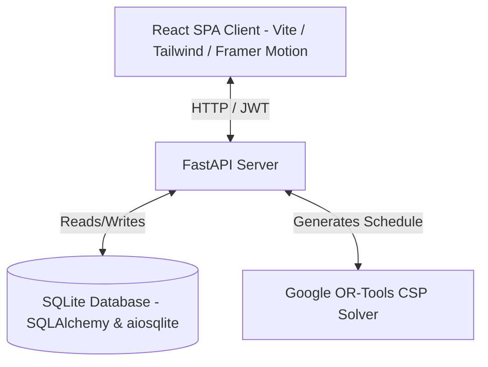

# Smart Timetable Management System

A premium, state-of-the-art college ERP scheduling platform. This system utilizes a **FastAPI** backend coupled with **Google OR-Tools** to automatically generate conflict-free academic timetables, and a modern **React (Vite + TailwindCSS + Framer Motion)** frontend for visual tracking, administration, and reporting.

---

## 🚀 Key Features

* **Constraint-Satisfaction Solver**: Automated, optimized scheduling of class sessions, professors, and rooms using Google OR-Tools, ensuring zero double-bookings or period overlaps.
* **Interactive Timetable Registry**: Custom drag-and-drop or edit panels for managing Registry resources (Faculty, Classrooms, Sections, and Subjects).
* **Real-time Session Trackers**: Active timeline widgets for students and teachers showing current class locations, instructors, break recesses, and daily continuity gaps.
* **Modern Login Flows**:
  - Animated forgot password and registration panels requesting admin coordination.
  - Emerald logout alert banners showing closed session account and timestamp metadata.
* **Role-Based Welcome Screens**: Clean splash portals welcoming **Admins**, **Staff**, and **Students** before displaying their dashboards.
* **Clean Dark/Light Modes**: Responsive visual themes optimized for mobile and desktop screens.

---

## 🛠️ Architecture & Tech Stack



- **Frontend**: React 18, Vite, TailwindCSS, Framer Motion, Lucide icons, Axios.
- **Backend**: FastAPI (Python 3.10+), SQLAlchemy 2.0 (Async/Await), SQLite (via `aiosqlite`).
- **Constraint Solver**: Google OR-Tools (Constraint Programming solver).

---

## 📦 Installation & Setup

Follow these steps to set up the workspace for local development:

### 1. Clone & Initialize Environments

Ensure you have **Python 3.10+** and **Node.js 18+** installed.

Create a Python virtual environment and activate it:
```bash
# Windows
python -m venv venv
venv\Scripts\activate

# macOS / Linux
python3 -m venv venv
source venv/bin/activate
```

### 2. Install Dependencies

Install root, frontend, and backend packages:
```bash
# Install backend python dependencies
pip install -r backend/requirements.txt

# Install root developer orchestrators
npm install

# Install frontend UI dependencies
npm install --prefix frontend
```

### 3. Initialize & Seed Database

Create the SQLite database file and pre-populate mock departments, sections, subjects, classrooms, faculty accounts, and pre-solve the semester schedule:
```bash
# Run the database migration and seeding script
python -m backend.app.seed
```

---

## 🏃 Running the Application

You can launch both the **FastAPI backend** and the **Vite dev server** concurrently using a single command:

```bash
npm run dev
```

* **Frontend portal**: Access [http://localhost:5173](http://localhost:5173) in your browser.
* **Backend OpenAPI Docs**: Access [http://localhost:8000/docs](http://localhost:8000/docs) to view/test REST APIs.

---

## 🔑 Quick Login Selector Accounts

For demonstration and testing, you can use the following seeded account credentials pre-built in the Sign In portal:

| Portal Role | Username | Purpose |
| :--- | :--- | :--- |
| **System Administrator** | `admin@college.edu` | Edit configurations, import data, override timetables. |
| **Faculty (Staff)** | `drrajeshkumar@college.edu` | View personal class schedules, check daily gaps. |
| **Enrolled Student** | `student.mcaa@college.edu` | View section class timelines, active lectures. |
