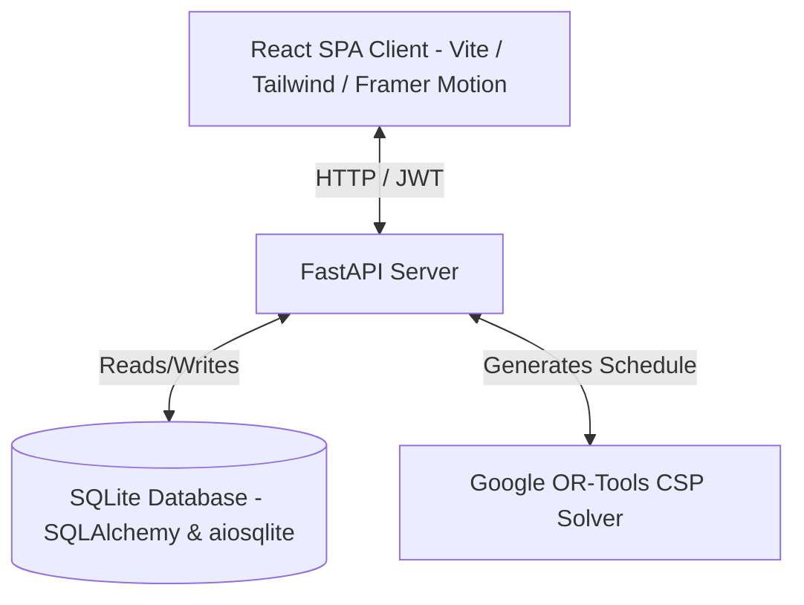

# 🎓 Smart Timetable Management System
 
A premium, state-of-the- srm university ERP scheduling platform. This system utilizes a **FastAPI** backend to automatically generate conflict-free academic timetables, and a modern **React (Vite + TailwindCSS + Framer Motion)** frontend for visual tracking, administration, and reporting.
 
---
 
## 🚀 Key Features
 
* **Constraint-Satisfaction Solver**: Automated, optimized scheduling of class sessions, professors, and rooms using Google OR-Tools, ensuring zero double-bookings or period overlaps.
* **Interactive Timetable Registry**: Custom drag-and-drop or edit panels for managing core academic entities (Faculty, Classrooms, Sections, and Subjects).
* **Real-time Session Trackers**: Active timeline widgets for students and teachers showing current class locations, instructors, break recesses, and daily continuity gaps.
* **Modern Login Flows**:
  - Animated forgot password and registration panels requesting admin coordination.
  - Emerald logout alert banners showing closed session account and timestamp metadata.
* **Role-Based Welcome Screens**: Clean splash portals welcoming **Admins**, **Staff**, and **Students** before displaying their dashboards.
* **Clean Dark/Light Modes**: Responsive visual themes optimized for mobile and desktop screens.
---
 
## 🛠️ Architecture & Tech Stack
 

 
| Layer | Technology |
| :--- | :--- |
| **Frontend** | React 18, Vite, TailwindCSS, Framer Motion, Lucide icons, Axios |
| **Backend** | FastAPI (Python 3.10+), SQLAlchemy 2.0 (Async/Await), Pydantic, python-jose (JWT) |
| **Database** | SQLite (via `aiosqlite`) |
| **Constraint Solver** | Google OR-Tools (CP-SAT Constraint Programming solver) |
| **Dev Orchestration** | `concurrently` (root `package.json`) to run frontend + backend together |
 
---
 
## 📋 Prerequisites
 
* **Python 3.10 – 3.11** (OR-Tools wheels are not consistently available for 3.12+; stick to this range to avoid install failures)
* **Node.js 18+** and **npm 9+**
* **Git**
---
 
## 📦 Installation & Setup
 
### 1. Clone the Repository
 
```bash
git clone https://github.com/your-org/smart-timetable-system.git
cd smart-timetable-system
```
 
### 2. Create & Activate a Python Virtual Environment
 
```bash
# Windows
python -m venv venv
venv\Scripts\activate
 
# macOS / Linux
python3 -m venv venv
source venv/bin/activate
```
 
### 3. Install Dependencies
 
```bash
# Backend Python dependencies
pip install -r backend/requirements.txt
 
# Root orchestrator dependencies (runs frontend + backend concurrently via `concurrently`)
npm install
 
# Frontend UI dependencies
npm install --prefix frontend
```
 
> **Note:** If `pip install ortools` fails, confirm your Python version is 3.10 or 3.11 (`python --version`) and that you're on a supported OS/architecture (Windows x64, macOS x64/arm64, or Linux x64).
 

### 4. Initialize & Seed the Database
 
Create the SQLite database and pre-populate mock departments, sections, subjects, classrooms, faculty accounts, and pre-solve a sample semester schedule:
 
```bash
python -m backend.app.seed
```
 
---
 
## 🏃 Running the Application
 
Launch both the **FastAPI backend** and the **Vite dev server** concurrently with a single command from the project root:
 
```bash
npm run dev
```
 
* **Frontend portal**: [http://localhost:5173](http://localhost:5173)
* **Backend OpenAPI Docs**: [http://localhost:8000/docs](http://localhost:8000/docs)
### Running Backend / Frontend Separately (optional)
 
```bash
# Backend only
uvicorn backend.app.main:app --reload --port 8000
 
# Frontend only
npm run dev --prefix frontend
```
 
---
 
## 🧩 Generating a Timetable
 
Once the app is running and the database is seeded, you can trigger the OR-Tools solver in two ways:
 
**Via the UI:** Log in as `admin@college.edu` → navigate to **Registry → Timetable → Generate Schedule** → select the target semester/department → click **Run Solver**.
 
The solver returns a conflict-free schedule assigning each section's subjects to a professor, room, and time slot with zero double-bookings.
 
---
 
## 🔑 Quick Login Selector Accounts
 
For demonstration and testing, use the following seeded accounts in the Sign In portal:
 
| Portal Role | Username | Purpose |
| :--- | :--- | :--- |
| **System Administrator** | `admin@college.edu` | Edit configurations, import data, override timetables. |
| **Faculty (Staff)** | `drrajeshkumar@college.edu` | View personal class schedules, check daily gaps. |
| **Enrolled Student** | `student.mcaa@college.edu` | View section class timelines, active lectures. |
 
---
 
## 📁 Project Structure
 
```
smart-timetable-system/
├── backend/
│   ├── app/
│   │   ├── main.py          # FastAPI entrypoint
│   │   ├── seed.py          # DB migration + seed script
│   │   ├── models/          # SQLAlchemy models
│   │   ├── routers/         # API route modules
│   │   ├── solver/          # OR-Tools CSP scheduling logic
│   │   └── auth/            # JWT auth & role-based access
│   ├── requirements.txt
│   └── .env.example
├── frontend/
│   ├── src/
│   │   ├── components/
│   │   ├── pages/
│   │   └── App.jsx
│   ├── package.json
│   └── .env.example
├── package.json              # Root orchestrator (concurrently)
└── README.md
```
